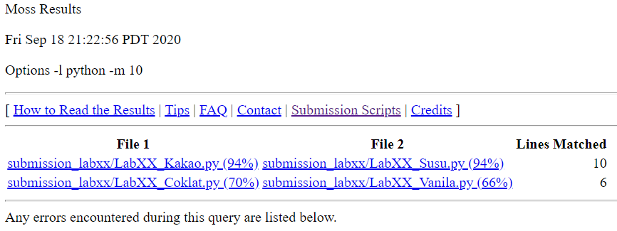
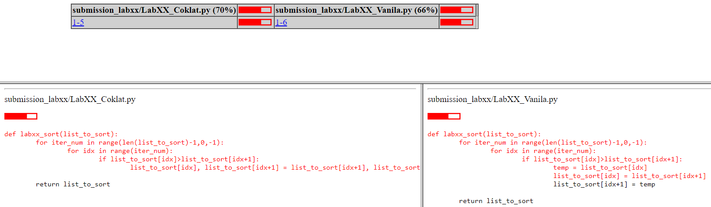

# Tutorial Penggunaan moss.py untuk Plagiarism Checker Lab DDP1

## Instalasi 
Instalasi dapat dilakukan dengan *package installer* untuk Python (``pip``). Instalasi dapat dilakukan dengan menuliskan salah satu daru dua *command line* ini pada *command prompt*:

```
pip install mosspy
```

```
python -m pip install mosspy
```

## Registrasi
Untuk menggunakan library ``moss.py``, perlu dilakukan registrasi dengan mengirimkan *email* ke ``moss@moss.stanford.edu`` dengan isi email sebagai berikut: 

```
registeruser
mail username@domain
```

Ganti ``username@domain`` dengan *email* anda. Setelah mengirim *email*, pihak moss akan mengirimkan sebuah *autoreply*. Cari potongan pesan seperti di bawah ini pada *autoreply*:

```
# The userid is used to authenticate your queries to the server; don't change it!
#
$userid=xxxxxxxx; 
```
**Note: Akan lebih mudah jika mencari menggunakan ``Ctrl+F`` atau ``F3``.**

Simpan nilai dari *variable* ``userid``. Nilai ini akan digunakan untuk menggunakan *library* ``moss``. 

## Penggunaan Library untuk Plagiarism Checker 
Telah dilampirkan *template script* bernama ``checker_template.py`` yang terdapat pada direktori ``Template_Script``.

*Template* tersebut digunakan untuk membuat *checker script* terpisah untuk setiap lab.

Berikut beberapa hal yang perlu diubah atau diisi pada *template script* untuk membuat *checker script*: 
1. Pada baris 4, isi variable userid sesuai dengan nilai yang disimpan ketika melakukan fase registrasi.
```python
# sesuaikan dengan userid anda
userid = 000000000 
```
2. Pada baris 10, isi variable sesuai dengan lokasi *template file* yang digunakan pada lab.
```python
# sesuaikan dengan penamaan berkas.
# jika tidak menggunakan template, silahkan block comment potongan kode ini
template_filename = "path/to/template_file/[insert filename].py"
m.addBaseFile(template_filename)
```
**Note: *comment block* potongan kode ini jika memang tidak memakai template kode.**

3. Pada baris 14, isi variable  sesuai dengan lokasi *submission file* lab. Gunakan pattern untuk menambahkan *submission file* secara bersamaan.
```python
# sesuaikan dengan penamaan berkas
submission_patternname = "path/to/submission_file/submission/LabX_*.py"
m.addFilesByWildcard(pattern_name)
```
4. Simpan script sebagai file terpisah.
5. Untuk melakukan pengecekan dengan *script* yang dibuat, jalankan *command line* ini:
```
python [lokasi dan nama berkas].py
```
6. Checker akan menghasilkan output berupa sebuah URL seperti di bawah ini:
```
Report URL: http://moss.stanford.edu/results/4/665016126326
```
Berikut contoh tampilan halaman dengan ``URL`` yang dihasilkan dari *checker script*.



Halaman akan menampilkan pasangan *submission* yang terindikasi plagiat. Anda dapat melihat baris kode mana saja yang sama dengan mengklik salah satu nama file. Nanti akan muncul tampilan seperti di bawah ini:



Untuk mencoba *script*, telah dilampirkan contoh *checker script* beserta *template* dan *submission script* pada direktori ``Tutorial_Script``.

**Disclaimer: Nama mahasiswa pada berkas contoh bersifat fiktik. Jika terdapat kesamaan dengan nama seorang individu di dunia nyata, itu merupakan murni suatu kebetulan.**